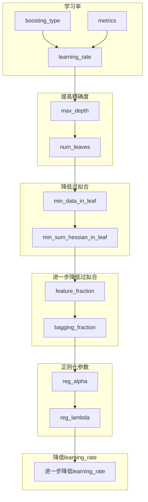

# lightGBM调参顺序

## 主要调参顺序

## 选值的具体内容

### 学习率和估计器

* `learning_rate`: 一开始选`learning_rate`比较高的值，方便训练。
* `boosting_type`/`boosting`：一般都默认选`gbdt`
* `n_estimators`/`num_iterations`/`num_boost_round`：一般选择一个较大的数，在cv的结果中查看最优迭代次数。
* 其他参数：
    - `max_depth`: 6（根据数据集大小来，一般4 ~ 10）
    - `num_leaves`: 50 (最好小于 `2 ** max_depth`)
    - `subsample`/`bagging_fraction`: 0.8 
    - `colsample_bytree`/ `feature_fraction`: 0.8

### 第二步：提高精确度

* `max_depth`: 4 ~ 10
* `num_leaves`：应该是小于 `2 ** max_depth`

### 第三步： `min_data_in_leaf`和`min_sum_hessian_in_leaf`

降低叶子里的过拟合

* `min_data_in_leaf`/`min_child_samples`：防止生成过深的树 15 ~ 30
* `min_sum_hessian_in_leaf`/`min_child_weight`：最小化海森值之和 0.0001 ~ 0.005

### 第四步： 通过采样和参数来防止过拟合

- `feature_fraction`：来进行特征子抽样 0.5 ~ 1
- `bagging_fraction`/`bagging_freq`：表示bagging频率 0.5 ~ 1

### 第五步：正则化参数

- `lambda_l1`/`reg_alpha` 0.001 ~ 5
- `lambda_l2`/`reg_lambda` 0.001 ~ 5

### 第六步：降低`learning_rate`

通过降低`learning_rate`来提供更好的效果
